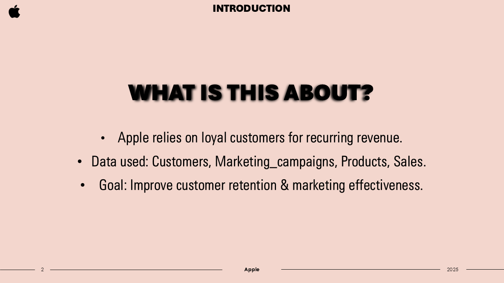
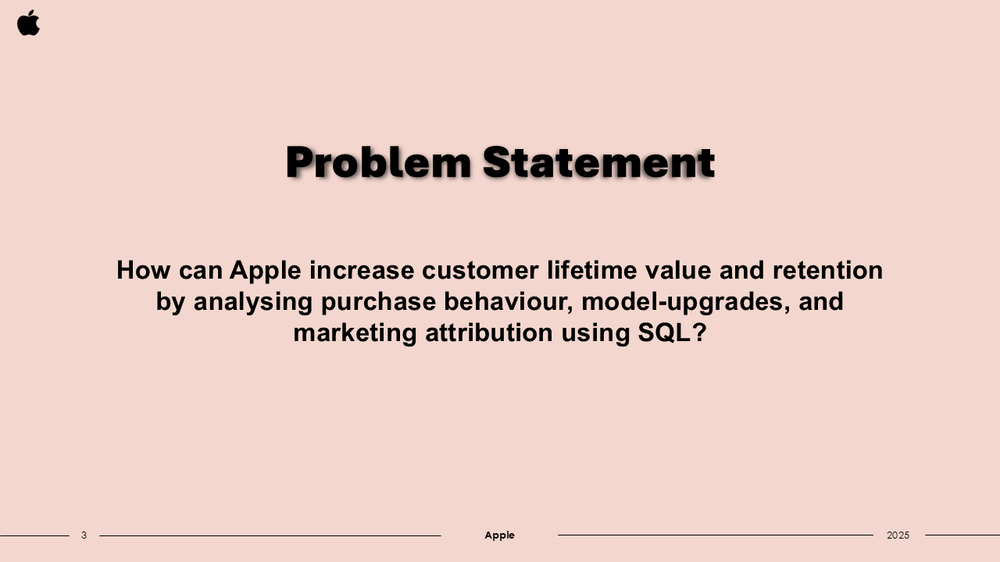
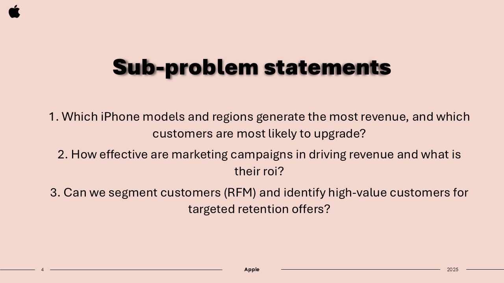
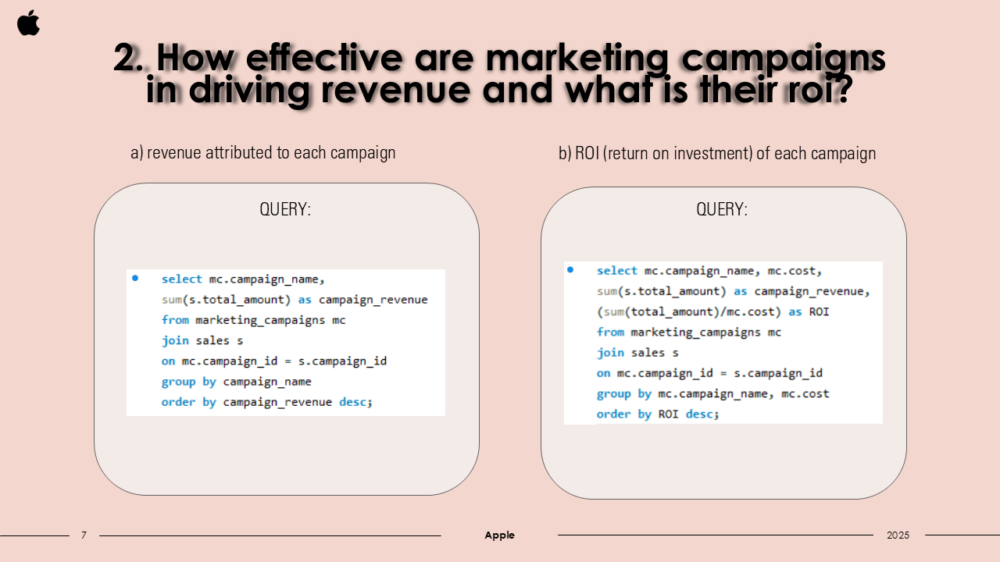
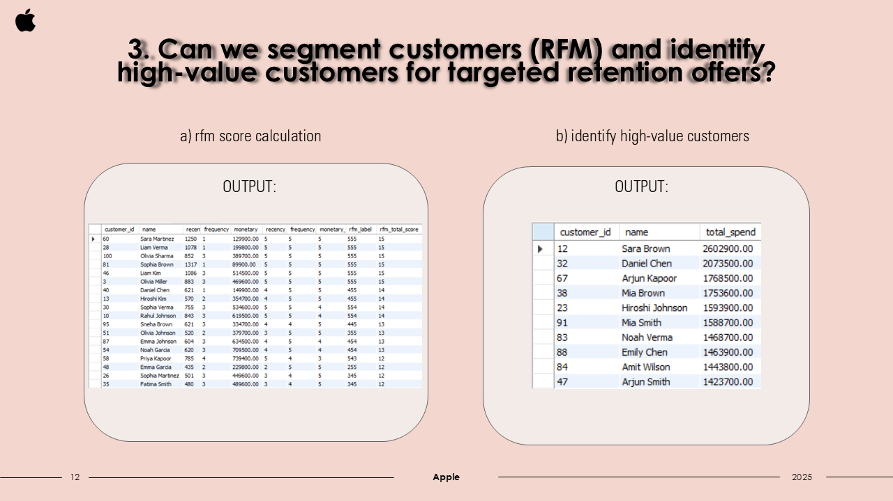
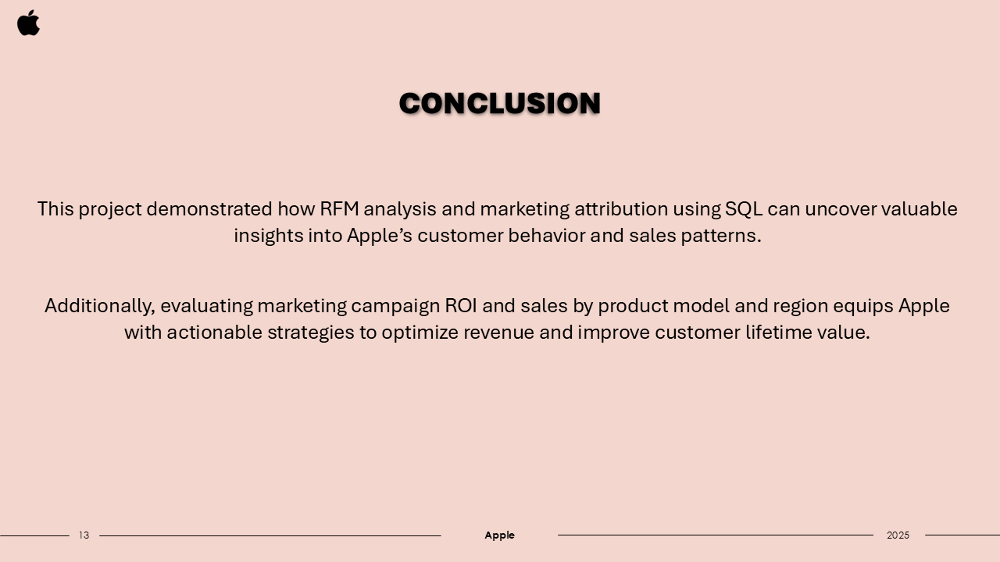

# Customer Loyalty & Marketing Attribution for Apple iPhones  
### Tools: SQL | 2025

## 📌 Project Overview  
This project analyzes Apple iPhone sales, customer behavior, and marketing effectiveness using SQL.
It focuses on how customer loyalty is influenced by purchasing patterns, upgrade behavior, and the impact of marketing campaigns.

The analysis includes:  
- Customer segmentation  
- RFM scoring  
- Attribution modeling for marketing ROI  
- Analysis of best-selling iPhone models  
- Region-wise revenue contribution  

---

## 🗂️ Objectives  
- Identify high-value and loyal customers  
- Measure campaign performance and ROI  
- Understand upgrade cycles and customer behavior trends  
- Analyze top-revenue models and regions  
- Build a Tableau dashboard for stakeholder insights  

---

## 📊 Key Insights  
- **Top-performing iPhone models** identified using SQL aggregation and ranking  
- **RFM segmentation** highlighted premium customers with high retention potential  
- **Marketing attribution** helped understand which campaigns generated the most revenue  
- SQL-based feature engineering helped predict **likely upgraders**  

---

## 🧠 Skills Demonstrated  
- SQL: Joins, Window Functions, CTEs, Aggregations  
- Business Case Analysis: Customer loyalty & marketing ROI  

## Slides with Queries & Insights

